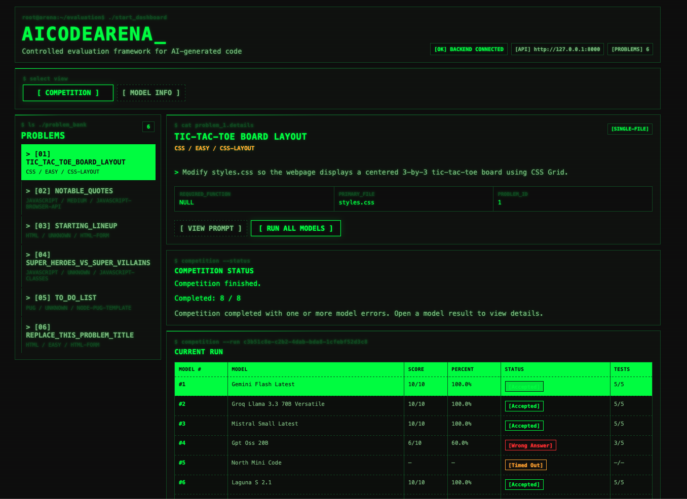
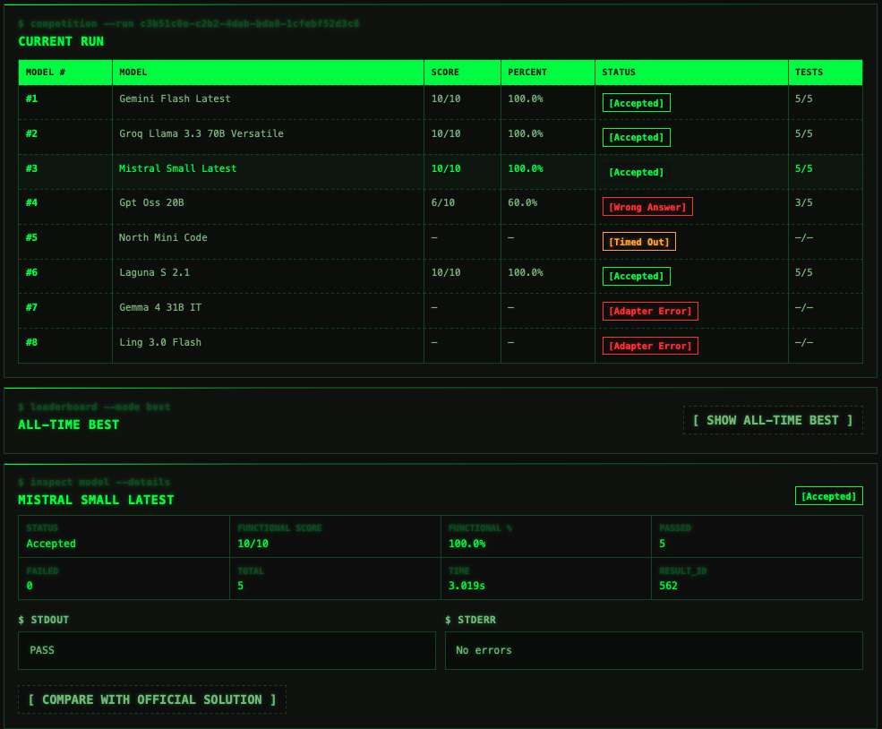
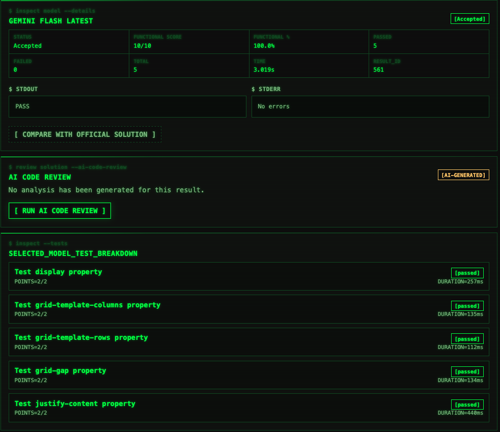
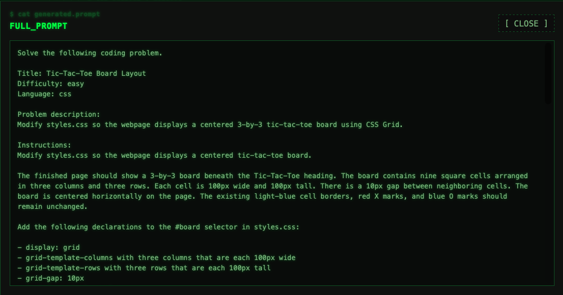

# AICodeArena

**Send the same coding problem to multiple AI models. Grade every submission with hidden tests. See who actually wins.**

AICodeArena is a full-stack platform for fairly evaluating and comparing AI-generated code across large language models. Pick a programming problem, fire it at several models at once — Gemini, Groq-hosted models, Mistral, and anything on OpenRouter — and watch a live leaderboard rank their submissions by real test results, not vibes.

    

## Screenshots

| Competition dashboard | Run results & leaderboard |
|---|---|
|  |  |

| Per-model test breakdown | Generated prompt (hidden tests excluded) |
|---|---|
|  |  |

---
## What it does

Most "which AI writes better code" debates are anecdotal. AICodeArena makes the comparison reproducible:

1. **Problem bank** — assignments defined as JSON (description, starter code, editable vs. read-only files, hidden tests).
2. **Prompt builder** — constructs model prompts *without* exposing hidden tests, so models can't game the grading.
3. **Multi-model competition** — sends the same prompt to every selected model in parallel via provider adapters.
4. **Validation** — submissions are sanity-checked before execution (never silently "repaired").
5. **Evaluation** — code runs against hidden tests in real runtimes:
   - Browser assignments → Playwright + Chromium + QUnit
   - Node/Pug assignments → Node.js + Jest + jsdom
6. **Persistence** — every run, result, and per-test outcome stored in SQLite.
7. **Dashboard** — live competition view, per-model test breakdowns, side-by-side comparison, and an AI code-review pass on saved results.

## Evaluation methodology

- **Same input, same rules.** Every model receives an identical prompt built from the same problem definition.
- **Hidden tests stay hidden.** Test files are never included in prompts; grading logic lives server-side only.
- **No auto-repair.** If a submission is malformed, it fails validation and is scored as-is — the leaderboard reflects what the model actually produced.
- **Traceability.** Each competition run records the prompt sent, raw model output, validation verdict, per-test results, and timing, so any ranking can be audited end to end.
- **Reference comparison.** Completed results can be diffed against official reference solutions to inspect *how* generated code differs, not just whether it passed.

## Tech stack

| Layer | Technology |
|---|---|
| Backend | Python, FastAPI, SQLAlchemy, Uvicorn |
| Frontend | React 18, Vite, Vitest + Testing Library |
| Browser evaluation | Playwright, Chromium, QUnit (vendored) |
| Node evaluation | Node.js, Jest, jsdom, Pug |
| Model providers | Google Gemini (GenAI SDK), Groq, Mistral, OpenRouter (dynamic model catalog) |
| AI code review | Separate reviewer provider/key via OpenRouter |
| Persistence | SQLite |
| Tests | 288 backend unit tests (`unittest`), frontend component tests (Vitest) |

## Quick start

**Prerequisites:** Python 3.11+, Node.js 18+, and API keys for whichever providers you want to compete (all keys go in `.env` — never commit them).

```bash
# Backend
cd backend
python3 -m venv .venv && source .venv/bin/activate
pip install -r requirements.txt
cp .env.example .env        # then fill in your API keys
playwright install chromium # for browser-based evaluations
uvicorn app.main:app --reload
# → http://127.0.0.1:8000  (API docs at /docs)

# Frontend (second terminal)
cd frontend
npm install
cp .env.example .env.local  # optional; defaults to the local backend
npm run dev
# → http://127.0.0.1:5173
```

Then: pick a problem → **RUN ALL MODELS** → watch the leaderboard fill in → click any model result for its test breakdown, reference comparison, and AI review.

### Run the tests

```bash
cd backend && ./.venv/bin/python -m unittest discover -s tests -v
cd frontend && npm test -- --run
```

## Project structure

```text
├── backend/
│   ├── app/                 # FastAPI app: routes, evaluators, provider adapters,
│   │                        # prompt builder, validators, persistence, AI review
│   ├── problem_bank/        # Problem definitions as JSON (5 sample problems included)
│   ├── scripts/             # Maintenance utilities (e.g. result resets)
│   ├── tests/               # 288 backend unit tests
│   └── .env.example         # Required env vars (placeholders only — no real keys)
├── frontend/
│   └── src/                 # React dashboard: competition view, leaderboard,
│                            # model comparison, result inspection
└── docs/
    ├── ARCHITECTURE.md      # End-to-end system design
    ├── ADDING_PROBLEMS.md   # How to author new problems
    └── HANDOFF.md           # Development notes
```

## What this project demonstrates

- **Systems design** — a multi-stage pipeline (prompt → generate → validate → execute → persist → present) with clean module boundaries.
- **Real integrations** — four LLM provider APIs with per-provider error handling, timeouts, retries, and a dynamic OpenRouter model catalog.
- **Test engineering** — hidden-test evaluation harnesses in two runtimes, plus 288 backend tests covering adapters, evaluators, validators, and storage.
- **Data integrity thinking** — prompts that can't leak answers, submissions graded as-written, fully auditable runs.

## Roadmap

- [ ] Public leaderboard snapshots / shareable run links
- [ ] More problem types (Python, SQL, multi-language)
- [ ] Cost/latency tracking per model alongside correctness
- [ ] CI for backend + frontend test suites

## Credits

Built in August 2026 by **Saad Beg** in collaboration with **Professor Hilford** (University of Houston).

## License

_TODO: add a LICENSE file (MIT recommended) before making this public._
